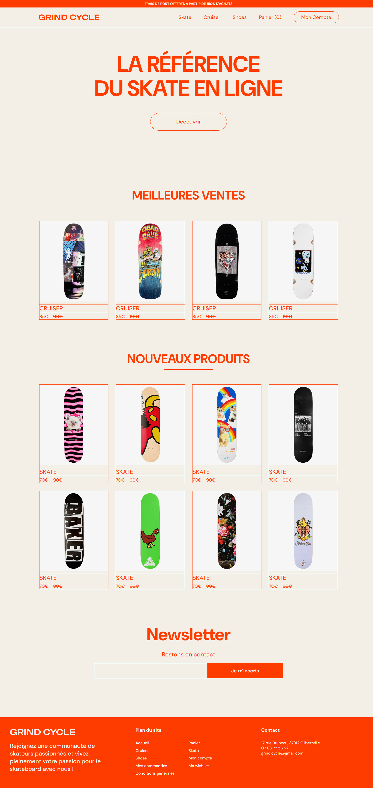

Voilà mon second projet personnel lié à la création d'une plateforme d'e-commerce : Grind Cycle v.1 ! J'ai conçu et développé cette plateforme d'e-commerce en utilisant React pour le front-end, Node.js, Mongoose, Vite, JWT et Express pour le back-end en stockant les données sur MongoDB.

Pour lancer le site :
- npm start dans frontend
- node index.js dans backend

